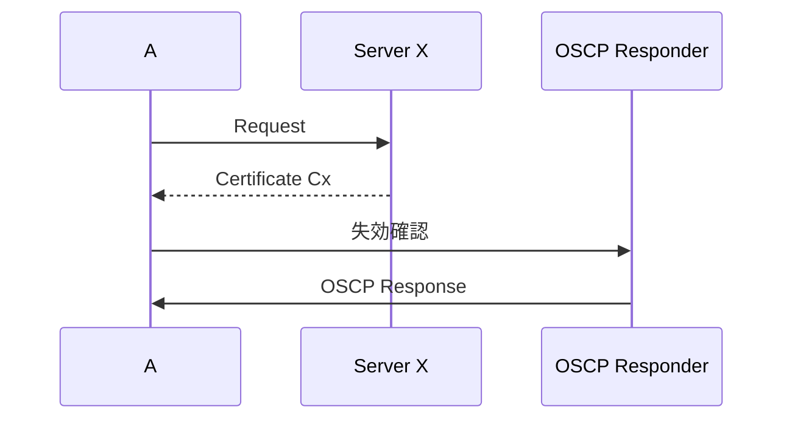
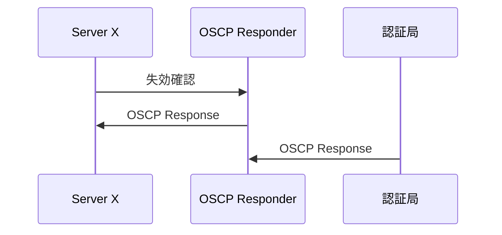
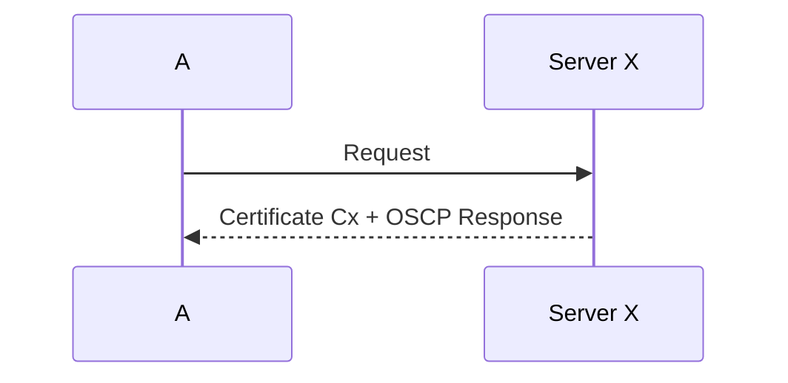
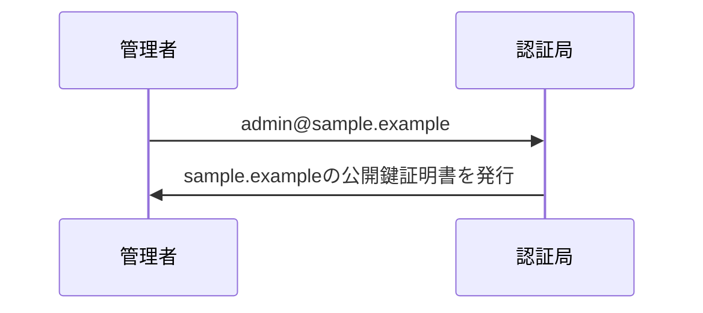
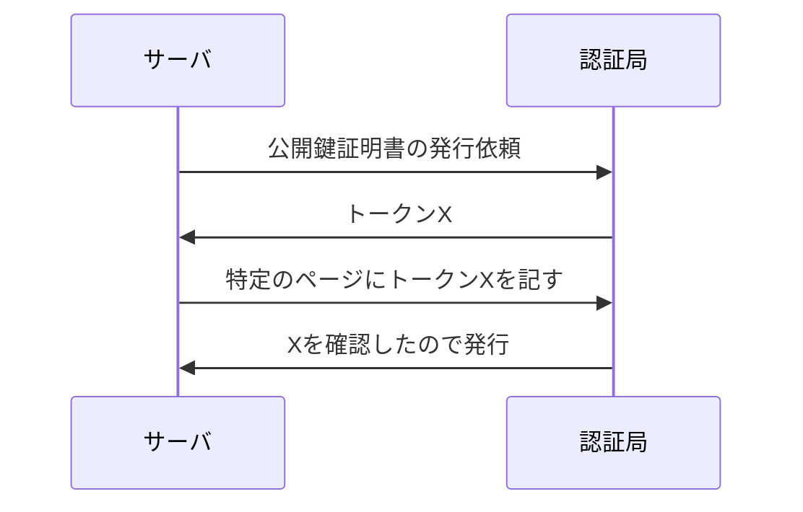
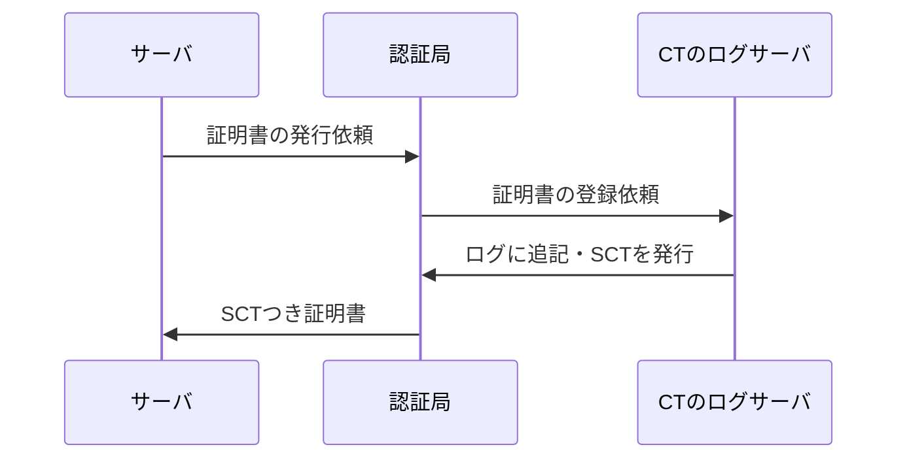

## ハッシュ関数
### 求められる性質
- 出力サイズが一定
- 一方向性
  - 元のデータの候補が十分にあるときのみ成立する
- 衝突困難性：異なる2個のデータで同じハッシュ値になるものを見つけるのが難しい
  - 第二現像計算困難性を含む
    - 第二現像計算困難性：あるデータが与えられたとき，そのハッシュ値と同じハッシュ値になる別のデータを見つけるのが難しい

→データの正しさや改ざん検知に使う

### パスワードのハッシュ値をそのまま保存するのは安全ではない
レインボーテーブル攻撃に弱い

### ソルト
ユーザごとに異なる乱数を用意し，(パスワード，ソルト)の組のハッシュを保存

### ストレッチング
ハッシュ値のハッシュ値をもとめる操作を何度も繰り返す

FIXME
- PBKDF2とは
- HMACとは
- PPAPとは
- SHA-256
- SHA-3

## PKI(公開鍵基盤)
人や組織に紐づく公開鍵の対応を保証する仕組み

### 認証局
人や組織に紐づく公開鍵を保証する機関

### 公開鍵証明書(サーバ証明書)
認証局が発行する証明書．人と公開鍵の紐づくを確認した証
X509という規格でフォーマットが定められている．
公開鍵と対応する秘密鍵をもつ所有者の属性情報に認証局の署名をつけたもの

### ルート認証局
自分で正当性を証明する認証局．ここで発行される証明書を自己署名証明書という
トラストアンカーと呼ばれる

### フィンガープリント
証明書のハッシュ値

### 証明書失効リスト(Certificate Revocation List)
PKIで失効した公開鍵証明書の一覧．
秘密鍵の漏洩や，署名鍵の漏洩があった場合，公開鍵証明書は意味がなくなる．
悪用される前に失効届を出す必要あり

#### CRLの問題点
サイズが増大し続ける

#### OCSP(Online Certificate Status Protocol)
証明書が失効していないかを確認する

OSCPレスポンダは有効性検証局やVA(Validation Authority)が管理・運用している

デメリット：アクセスしようとしているサイトの情報がOSCPレスポンダに渡るのでプライバシーの問題が発生する

#### OCSPステープリング
サーバで最新の失効情報を保持して起き，クライアントがサーバに接続した際に証明書と失効情報を返す．サイトのアクセス情報が漏洩しなくなり，通信速度も向上する

### その他
- CRLSets
- OneSRL
- CRLite

#### ドメイン証明
認証局が公開鍵証明書を発行する際に，申請者が申請ドメインの管理者であると判断して認証する方法

メール認証

admin@のメールは管理者しか使えないのでsample.exampleの管理者であると判断できる

サーバ認証

- ACME(Automatic Certificate Management Environment)
- Let's Encrypt

#### ドメイン認証の問題点
ずさんな認証局がadminの文字列の存在のみで証明書を発行するケースがある

- 組織認証
- 拡張認証

### 証明書の透明性(Certificate Transparency)
SCT(Signed Certificate Timestamp)：ログサーバによる署名がついたタイムスタンプ

